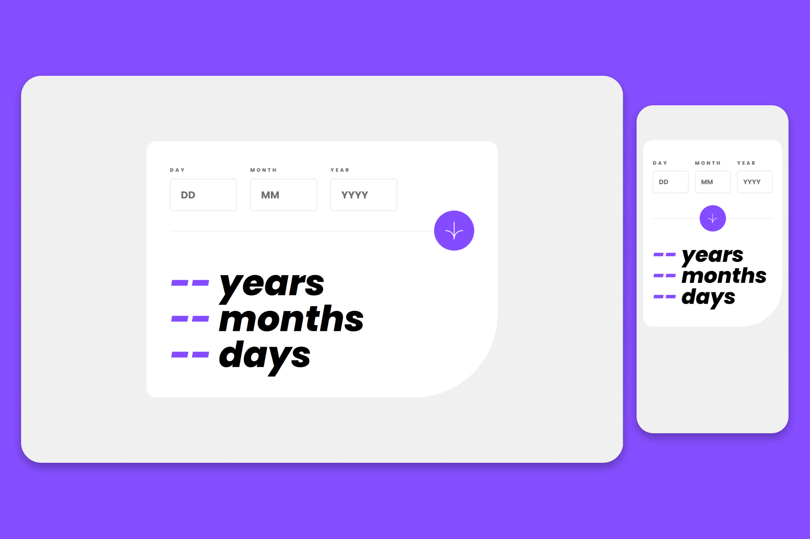

# Frontend Mentor - Age calculator app

This is a solution to the [Age calculator app challenge on Frontend Mentor](https://www.frontendmentor.io/challenges/age-calculator-app-dF9DFFpj-Q).

<p align="center">
    
    
    
</p>

<h1 align="center">
    
</h1>

## 🎯 The challenge

Users should be able to:

- View an age in years, months, and days after submitting a valid date through the form
- Receive validation errors if:
  - Any field is empty when the form is submitted
  - The day number is not between 1-31
  - The month number is not between 1-12
  - The year is in the future
  - The date is invalid e.g. 31/04/1991 (there are 30 days in April)
- View the optimal layout for the interface depending on their device's screen size
- See hover and focus states for all interactive elements on the page

## 🛠️ Built with

- HTML
- CSS
- Flexbox
- CSS Grid
- Mobile-first workflow
- JavaScript

## 🚀 How to clone

```bash
$ git clone https://github.com/pejamp/age-calculator
$ cd age-calculator
```

## 🌐 Project

- Solution URL: [Add solution URL here](https://www.frontendmentor.io/solutions/html-css-javascript-NfMSBTzivH)
- Live Site URL: [Add live site URL here](https://age-calculator-steel.vercel.app/)

## 👨‍💻 Author

<a href="https://github.com/pejamp">
 
 <br />
 <sub><b>Pedro Rodrigues</b></sub>
</a> 
<a href="https://github.com/pejamp"></a>
<br />

## Contact me!

[](https://www.linkedin.com/in/pedro-rodrigues-3a3647176/)
[](mailto:pedro.roguea@gmail.com)
